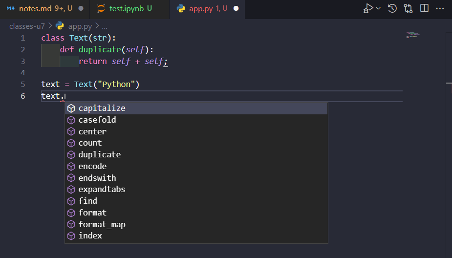

# U7- Classes

## 1- Classes

A class is a blue print for creating new objects.

An object is an instance of a class

## 2- Creating classes

To create classes in Python we have to use the _class_ parameter and name the function. To name the function we can use the Pascal naming convection (We use a capatilize letter to name a Class). Here is an example:

```python
class MyPoint:
```

In a class we can define several functions and to do it it's necessary to use the _def_ parameter. All fucntions in the classes should have one parameter, and this parameter is called `self`.

Here is an example:

```python
class Point:
    def draw(self):
        print("draw")

point = Point() # This return a Point object

point.draw()
```

Sometimes we have an object and we want to know if this object is an instance of a given class. We can use the `isinstance` function for this.

Here is an example:

```python
class Point:
    def draw(self):
        print("draw")

point = Point() # This return a Point object

print(isinstance(point,Point))

```

## 3- Constructors

`self` is a refrence to the current point object. And we used to declare the constructor.
To create a constructur we have t create a `def __init__` function and declare the attributes.

```python
class Point:

    def __init__(self, x:int, y:int) -> None:
        self.x = x
        self.y = y

    def draw(self):
        print(f"Point ({self.x},{self.y})")

point = Point(1,2)

point.draw()
```

## 4- Class vs Instance Attributes

> Objects in Python are Dynamic

The attributes that we declare in the constructor are **instance attributes**. This attributes are different in each Object.

We can also define **class attributes** and they are the same across all instances of the class.
If any fo these values is changed during the operation, this value will change for **EVERY OBJECT** created with that class.

Here is an example:

```python
class Point:

    default_color = "red"

    def __init__(self, x:int, y:int) -> None:
        self.x = x
        self.y = y

    def draw(self):
        print(f"Point ({self.x},{self.y})")

point = Point(1,2)

another_point = Point(3,4)

print(point.default_color) #red

print(another_point.default_color) #red

Point.default_color = "yellow"

print(point.default_color) #yellow

print(another_point.default_color) #yellow
```

## 5- Class vs Instance Methods

Class methods are methods that are called on the class itself, not on a specific object instance. Therefore, it belongs to a class level, and all class instances share a class method.

- **A class method is bound to the class** and not the object of the class. It can access only class variables.

- It can modify the class state by changing the value of a class variable that would apply across all the class objects.

In method implementation, if we use only class variables, we should declare such methods as class methods. The class method has a `cls` as the first parameter, which refers to the class.

Class methods are used when we are **dealing with factory methods**. Factory methods are those methods that **return a class object for different use cases**. Thus, factory methods create concrete implementations of a common interface.

The class method can be called using ``ClassName.method_name()`` as well as by using an object of the class.

Example:

```python
class Point:

    def __init__(self, x:int, y:int) -> None:
        self.x = x
        self.y = y

    @classmethod
    def zero(cls):
        return cls(0,0) #This is like calling Point(0,0)
        

    def draw(self):
        print(f"Point ({self.x},{self.y})")

point = Point.zero()

point.draw()
```

Internet example: [ClassMethodPy](https://pynative.com/python-class-method/#:~:text=Delete%20Class%20Methods-,What%20is%20Class%20Method%20in%20Python,the%20object%20of%20the%20class.)

## 6- Magic Methods

These are the methods that have two underscoares at the beginning and end of theirname, and they are called automatically by python interpreter.
depending on how we use our objects and classes.
In this link there is more info about this magic methods: [PythonMagicMethods](https://rszalski.github.io/magicmethods/)

Here is an example. 

`__str__(self)` is called when we try to convert an object to a string.

If we print `point` weare going to get the following result:

```python
class Point:

    def __init__(self, x:int, y:int) -> None:
        self.x = x
        self.y = y

    def draw(self):
        print(f"Point ({self.x},{self.y})")

point = Point(1,2)

print(point)
```

    <__main__.Point object at 0x0000020E9C917D60>

We get the name of our module (_main_) followed by the class name (_Point_), and the address of this point object in memory (_0x0000020E9C917D60_).

By default, `__str__` method returns the name of the class of this object, followed by it's memory address.

But we can reimplement this method to get a better result.

```python
class Point:

    def __init__(self, x:int, y:int) -> None:
        self.x = x
        self.y = y

    def __str__(self) -> str:
        return f"({self.x},{self.y})"

    def draw(self):
        print(f"Point ({self.x},{self.y})")

point = Point(1,2)

print(point)
```

We got the next result:

    (1,2)

## 7- Comparing Objects

There are times when we need to compare two objects, for example, hwere we have this point object, if I define another point object, with the exact same values 

```python
class Point:

    def __init__(self, x:int, y:int) -> None:
        self.x = x
        self.y = y

point = Point(1,2)

other = Point(1,2)

print(point == other)
```

We got a **FALSE**. This is because the `==` operator is comparing the object address and now the value inside the objects. To solve this we can use the magic method: `__eq__`.

```python
class Point:

    def __init__(self, x:int, y:int) -> None:
        self.x = x
        self.y = y
    
    def __eq__(self,other): #Recive two parameters
        return self.x == other.x and self.y == other.y

point = Point(1,2)

other = Point(1,2)

print(point == other)
```

This will return a **TRUE** value.

But if want to know if the value is greater `point > other`. We will get this error:

    Traceback (most recent call last):
      File "C:\Users\campedga\Desktop\courses\PyCourseMosh\classes-u7\app.py", line 14, in <module>
        print(point > other)
    TypeError: '>' not supported between instances of 'Point' and 'Point'

To avoid this we have to use another magic method.

```python
class Point:

    def __init__(self, x:int, y:int) -> None:
        self.x = x
        self.y = y
    
    def __eq__(self,other): #Use two parameters
        return self.x == other.x and self.y == other.y

    def __gt__(self,another): #Use two parameters
        return self.x > other.x and self.y > other.y

point = Point(10,20)

other = Point(1,2)

print(point > other)
```

This will print **TRUE**. If we use the '<' operator python will know what to do with this:

```python
class Point:

    def __init__(self, x:int, y:int) -> None:
        self.x = x
        self.y = y
    
    def __eq__(self,other): #Use two parameters
        return self.x == other.x and self.y == other.y

    def __gt__(self,another): #Use two parameters
        return self.x > other.x and self.y > other.y

point = Point(10,20)

other = Point(1,2)

print(point < other)
```

It will return **FALSE**.

## 8- Performing Arithmetic Operations

Here is an example:

```python
class Point:

    def __init__(self, x:int, y:int) -> None:
        self.x = x
        self.y = y
    
    def __add__(self, other):
        return Point(self.x + other.y, self.y + other.y)

point = Point(10,20)

other = Point(1,2)

print(point + other)
```

This will create an object with the results and if we print the values we will get this:

    <__main__.Point object at 0x000001F85AE0BA60>


If we want to see the results we can store this object.

```python
class Point:

    def __init__(self, x:int, y:int) -> None:
        self.x = x
        self.y = y
    
    def __add__(self, other):
        return Point(self.x + other.y, self.y + other.y)

point = Point(10,20)

other = Point(1,2)

combined = point + other

print(combined.x)
```

This is the result: 12

## 9- Making Custom Containers

We can use the following scenario to work with containers. Let's say we want to use a class that allow us to see its lens and iterate though the it.

```python
class TagCloud:

cloud = TagCloug()
len(cloud)
cloud["python"] = 10
for tag in cloud:
    print(tag)
```

Here is the class that we have to use:

```python
class TagCloud:

    def __init__(self) -> None:
        self.tags = {}
    
    def add(self,tag):
        self.tags[tag.lower()] = self.tags.get(tag.lower(),0) + 1

    def __getitem__(self,tag):
        return self.tags.get(tag.lower(),0)

    def __setitem__(self,tag,value):
        self.tags[tag.lower()] = value

    def __len__(self):
        return len(self.tags)

    def __iter__(self):
        return iter(self.tags)


cloud = TagCloud()

cloud.add("python")
cloud.add("python")
cloud.add("python")
cloud.add("JavaScript")

print(len(cloud))

for c in cloud:
    print(cloud[c])
```

The class by itsself is not iterable and because of that we have to use the other magic methods.

## 10- Private Members

In the previous program if we acces the python tag as:

```python
print(cloud["PYTHON"])
```

We wont get any error because the method that we create is using the `lower()`.

But if we try it like this:

```python
print(cloud.tags["PYTHON"])
```

The program crash because the dictionary doesn't count with the "PYTHON" key.

We can declare the `tags` attribute as private to avoid the user to use the tag attribute.

```python
class TagCloud:

    def __init__(self) -> None:
        self.__tags = {}
    
    def add(self,tag):
        self.__tags[tag.lower()] = self.__tags.get(tag.lower(),0) + 1

    def __getitem__(self,tag):
        return self.__tags.get(tag.lower(),0)

    def __setitem__(self,tag,value):
        self.__tags[tag.lower()] = value

    def __len__(self):
        return len(self.__tags)

    def __iter__(self):
        return iter(self.__tags)


cloud = TagCloud()

cloud.add("python")
cloud.add("python")
cloud.add("python")
cloud.add("JavaScript")

```

Double undersocre (`__`) allow us to create private members. This notation will inform to the user that we want to keep this attribute as private.

So if we try to prin the `__tags` variable weare gointto get an error:

    Traceback (most recent call last):
      File "C:\Users\campedga\Desktop\courses\PyCourseMosh\classes-u7\app.py", line 29, in <module>
    print(cloud.__tags)
    AttributeError: 'TagCloud' object has no attribute '__tags'

Tehcnically these member are still accessible from the outside, it's just a little harder to access them.

To access it, we can use the `__dict__` method. This is a dictionary that holds all the attributes in this class.

```python
class TagCloud:

    def __init__(self) -> None:
        self.__tags = {}
    
    def add(self,tag):
        self.__tags[tag.lower()] = self.__tags.get(tag.lower(),0) + 1

    def __getitem__(self,tag):
        return self.__tags.get(tag.lower(),0)

    def __setitem__(self,tag,value):
        self.__tags[tag.lower()] = value

    def __len__(self):
        return len(self.__tags)

    def __iter__(self):
        return iter(self.__tags)


cloud = TagCloud()

cloud.add("python")
cloud.add("python")
cloud.add("python")
cloud.add("JavaScript")

print(cloud.__dict__)
```

Here is the result:

    {'_TagCloud__tags': {'python': 3, 'javascript': 1}}

## 11- Properties

There are times that you want to have control over an attribute in a class.
For example we create a class to definea product but we dont want have negative products.

```python

class Product:
    def __init__(self,price) -> None:
        self.price = price

product = Product(-50)
```

Python will execute the previous code without a problem bu we don't want this.

We want the code detect when the user is passing a incorrect value. There are 3 ways of doing this.

1. Uing the _getter_ and _setter_ methods and setting the attribute as private:

```python
class Product:
    def __init__(self,price) -> None:
        self.set_price(price)

    def get_price(self):
        return self.__price

    def set_price(self, value):
        if value < 0:
            raise ValueError("Price cannot be negative.")
        self.__price = value

product = Product(-50)
```

The terminal will output the next error:

    Traceback (most recent call last):
      File "C:\Users\campedga\Desktop\courses\PyCourseMosh\classes-u7\app.py", line 14, in <module>
        product = Product(-50)
      File "C:\Users\campedga\Desktop\courses\PyCourseMosh\classes-u7\app.py", line 4, in __init__
        self.set_price(price)
      File "C:\Users\campedga\Desktop\courses\PyCourseMosh\classes-u7\app.py", line 11, in set_price
        raise ValueError("Price cannot be negative.")
    ValueError: Price cannot be negative.

2. Using a property

A property is an object that sits in front of an attribute and allows us to get oret the value of an attribute.

```python
class Product:
    def __init__(self,price) -> None:
        self.__price = price

    def get_price(self):
        return self.__price

    def set_price(self, value):
        if value < 0:
            raise ValueError("Price cannot be negative.")
        self.__price = value

    #price = property(get_price,set_price)
    price = property(
        fget=get_price,
        fset=set_price
    )

product = Product(10)

print(product.price)
```

3. Using decorators

To not show all the _getter_ and _setter_ attributes we can use decorators to make our code simple.

```python
class Product:
    def __init__(self,price) -> None:
        self.price = price #The price property works as an attribute
    
    @property
    def price(self): 
        return self.__price

    @price.setter
    def price(self, value):
        if value < 0:
            raise ValueError("Price cannot be negative.")
        self.__price = value

product = Product(-10)

print(product.price)
```

## 12- Inheritance

Inheritance is a mechanism that allows us to define the common behavior or common functions in one class, and then inherit them in other classes.

Let's say we want to create a class for Mammals and Fishes:

```python
class Mammal:
    def eat(self):
        print("eat")
    
    def walk(self):
        print("walk")

class Fish:
    def eat(self):
        print("eat")
    
    def swim(self):
        print("swim")
```

We can save some lines of code by creating a more general class:

```python
class Animal:
    def eat(self):
        print("eat")

class Mammal(Animal):
    def walk(self):
        print("walk")

class Fish(Animal):
    def swim(self):
        print("swim")
```

Inheritance not only is limit to inherance methods, it can also inherance attributes

```python
class Animal:
    def __init__(self) -> None:
        self.age = 1

    def eat(self):
        print("eat")

# Animal: Parent, Base
# Mammal: Child, Sub

class Mammal(Animal):
    def walk(self):
        print("walk")

class Fish(Animal):
    def swim(self):
        print("swim")
```
## 13- The Object Class

The `isinstance()` function returns True if the specified object is of the specified type, otherwise False.

If the type parameter is a tuple, this function will return True if the object is one of the types in the tuple.

**Syntax:** isinstance(object, type)

**Parameter Values:**

|Parameter  |                      Description                     |
|   ---    |                         ---                          |
| object   | Required. An object                                  |
|  Type    | A type or a class, or a tuple of types and/or classes |

**Examples:**

```python
x = isinstance("Hello", (float, int, str, list, dict, tuple))
```

```python
class myObj:
  name = "John"

y = myObj()

x = isinstance(y, myObj)
```

The `issubclass()` function returns True if the specified object is a subclass of the specified object, otherwise False.

|Parameter  |                      Description                     |
|   ---    |                         ---                          |
| object   | Required. An object                                  |
|  Type    | A type or a class, or a tuple of types and/or classes |

**Example:**

```python
class myAge:
  age = 36

class myObj(myAge):
  name = "John"
  age = myAge

x = issubclass(myObj, myAge)
```

## 14- Method Overriding

Method overriding means replacing or extending a method defined in the base class.

Lest say we have an _Animal_ class that the one shown below:

```python
class Animal:
    def __init__(self) -> None:
        self.age = 1

    def eat(self):
        print("eat")
```

And that we want to create a new class called _Mammal_ that inherance the methods and attributes from the _Animal_ class but in addtion we want to add a new attribute in the constructor.
To to it we have to Override the _init_ method.

```python
class Animal:
    def __init__(self) -> None:
        self.age = 1

    def eat(self):
        print("eat")

class Mammal(Animal):
    def __init__(self) -> None:
        super().__init__()
        self.weight = 2

m = Mammal()

print(m.weight)
```

The _super()_ funtion will help us to inheritance the previous attributes defined in the _Animal_ constructor.

## 15- Multi-level Inheritance

Inheritance is a good thing, it prevents code duplication and allows us to reuse code. But the Multi-level Inheritance can significantly increase the complexity of your sofware.

```python
class Animal:
    def __init__(self) -> None:
        self.age = 1

    def eat(self):
        print("eat")

class Bird(Animal):
    def fly(self):
        print("fly")

class Chicken(Bird):
    pass
```

n the previous code we used the _Bird_ class to create the _Chicken_ class, but the problem with this is that the _Chicken_ class shouldn't be able to have the `fly() method. This is an abuse of Inheritance.
The best practice is to limit the inherance to 1 or 2 levels.

## 16- Multiple Inheritance

Python supports Multiple Inheritance unlike SystemVerilog. It is recommended to use multiple inheritance only when the two classes have different methods.

Here is an example:

```python
class Employee:
    def greet(self):
        print("Employee Greet")

class Person:
    def greet(self):
        print("Person Greet")

class Manager(Employee,Person):
    pass

manager = Manager()

manager.greet()
```

In the previous code, _Manager_ will check if one of the classes has the _greet_ method. _Manager_ will always check the first class that you are introducing (_Employee_). Becuase of this the output that we got is:

```text
Employee Greet
```

If we are wrking with too similar classes this could cause issues in our code. That's why it is recommended to use this with different type of classes.

## 17- A Good Excample of Inheritance

Let's say we want to create a code that allow us to read a stream of data from a file, from a network, or from the memory. All these streams have a few things in common. we can open them, we can cloe them, and read data from them.

```python
class InvalidOperationError(Exception):
    pass

class Stream:
    def __init__(self) -> None:
        self.openned = False

    def open(self):
        if self.openned:
            raise InvalidOperationError("The stream is already openned")
        self.openned = True

        print("Stream openned")
    
    def close(self):
        if not self.openned:
            raise InvalidOperationError("The stream is already closed")
        self.openned = False
        print("Stream closed")

class FileStream(Stream):
    def read(self):
        print("Reading from file")

class NetworkStream(Stream):
    def read(self):
        print("Reading from Network")

file_stream = FileStream()

file_stream.open()

file_stream.read()

file_stream.close()
```

## 18- Abstract Base Classes

We're going to continue with example from the last lecture. There are a couple of issues with the implementation that we created.

_Stream_ is just a base class and the user shouldn't be able to used directly (The user can't create a instance using the _Stream_ class).
To avoid this we can define this class as a **abstract class**.
Another thing is that we want all the subclasses to have read method but this method will be implemented in different way depending of the type of stream we want to use. Because of this we are going to declare this method as abstract.

First, we need to import the _abstract_ class (ABC) and the _abstract_ decorator.

```python
from abc import ABC, abstractmethod
```

After this, we can define our class and it's read method as abstract:

```python
from abc import ABC, abstractmethod

class InvalidOperationError(Exception):
    pass

class Stream(ABC):
    def __init__(self) -> None:
        self.openned = False

    def open(self):
        if self.openned:
            raise InvalidOperationError("The stream is already openned")
        self.openned = True

        print("Stream openned")
    
    def close(self):
        if not self.openned:
            raise InvalidOperationError("The stream is already closed")
        self.openned = False
        print("Stream closed")
    
    @abstractmethod
    def read(self):
        pass

class FileStream(Stream):
    def read(self):
        print("Reading from file")

class NetworkStream(Stream):
    def read(self):
        print("Reading from Network")


file_stream = FileStream()

file_stream.open()

file_stream.read()

file_stream.close()

```

## 19- Polymorphism

We're going to use a example similar to the one we used in the previous lecture.

```python
from abc import ABC, abstractclassmethod

class UIControl(ABC):
    @abstractclassmethod
    def draw(self):
        pass

class TextBox(UIControl):
    def draw(self):
        print("TextBox")

class DropDownList(UIControl):
    def draw(self):
        print("DropDownList")

def draw(control):
    control.draw()

text = TextBox()

drop = DropDownList()

draw(text) 

draw(drop)

```

In here we create an abstract class and from this base class we are going to create a couple more. Also, we are going to define a function that will call the `draw` method from the classes.

Depending of the object that we pass to the `draw` function, we are goin to have a different response. This is the base of Polymorphism, to have a different response from the same code.

Here is the response that we got from the previous code:

```
TextBox
DropDownList
```

## 20- Duck Typing

So to achieve polymorphic behavior, you start by defining the base class. And in this class, we define the common behavior, or the common method that we need in this derivative. With this we achieve polymorphic behvior in our draw function on line 22. So, depending on the type of control object that you're working with at run time, this draw method takes a different form. 

```python
from abc import ABC, abstractclassmethod

class UIControl(ABC):
    @abstractclassmethod
    def draw(self):
        pass

class TextBox(UIControl):
    def draw(self):
        print("TextBox")

class DropDownList(UIControl):
    def draw(self):
        print("DropDownList")

def draw(controls):
    for control in controls:
        control.draw()

text = TextBox()

drop = DropDownList()

draw([text,drop]) #prints

##TextBox
##DropDownList
```

## 21- Extending Built-in Types

In Python, we can also use inheritance with the built in types. For example, we can create a class of _Text_, and have it inherit from the _string_ class. With this text class will inherit all the features of Python strings, but we can also add addiotnal features to it.

For example, we can add the ability to summarize it or duplicate it, and so on. So, let's define a method called duplicate.



With this now the text object can use all the _string_ methods.

Here is another example:

```python
class TrackableList(list):
    def append(self, __object) -> None:
        print("Append called")
        return super().append(__object)
    
list = TrackableList()

list.append("1")
```

In the previous code with added it an extra action to the _append_ method. (We didn't override it).

## 22- Data classes

Python compare objects based in where they are located in memory.

```python
class Point:
    def __init__(self, x,y) -> None:
        self.x = x
        self.y = y

p1 = Point(1,2)
p2 = Point(1,2)

print(p1 == p2)
```

If we run the previous code we are going to have a **False**, because these objects are located in different spaces in memory.

To solve this problem, we have to implement a miguc mehthod: `__eq__`

```python
class Point:
    def __init__(self, x,y) -> None:
        self.x = x
        self.y = y

    def __eq__(self, other) -> bool:
        return self.x == other.x and self.y == other.y
    

p1 = Point(1,2)
p2 = Point(1,2)

print(p1 == p2)
```

This will return **True**.

However, writing all this code for data classes is a little bit tedious. If you are dealing with classes that have no behavior, no methods, they only have data, you can use a main couple isntance.

```python
from collections import namedtuple

Point = namedtuple("Point", ["x","y"])

p1 = Point(x=1,y=2)
p2 = Point(x=1,y=2)

print(p1 == p2)
```
