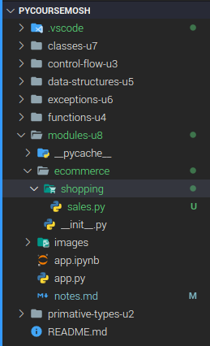

# 8-Modules

## 1- Creating Modules

We have the following function:

```python
#File: app.py
def calc_tax():
    pass
def calc_shipping():
    pass
```

And we want to relocate this functions in a file called sales.py

```python
#File: sales.py
def calc_tax():
    pass
def calc_shipping():
    pass
```

Now we want to use the code inside the _sales_ module.

There are two ways of doing this:

- Option #1

```python
from sales import calc_shipping

calc_shipping()
```

If we want to import several methods we can use a _comma_.

```python
from sales import calc_shipping, calc_tax

calc_shipping()

calc_tax()
```

- Option #2

```python
import sales 

sales.calc_shipping()
```

## 2- Compiled Python Files

In this folder we have the following folders:


If we run the _app.py_ program this will create a new folder:


In this new folder (`__pycache__`) we have a list of the modules that we import into our program.
So currently we have the compiled version of the sales module.

The reason of why python stores these compiled files in this stored folder is to speed up  module loading. So next time we load our program, python will look at the content of this folder, and if we do have the compiled version of the module, python will simply load that compiled version.

## 3- Module Search Path

When we use `import` in python, python will look for the .py file.
So if for example we have somthing like:

```python
import sales
```

Python will look for a file called _sales.py_.

If we use the following `sys.path` python will give us an array with the multiple paths to find a module.
The first element in this array represents the current folder.

So when python sees an import statement, it will search all thesedirectories to find this module. As soon asit finds the module, our search stops there.  

## 4- Packages

Currently all out files or modules are in this folder, but as our application grwos, we probably want to organize this calss into sub directories, otherwise we''ll end up with hundreds or even thousands of python files or even python modules in one folder, that is not good.


To avoid this kind of situation we can create sub directories.

For tis example we are going to a subdirectory called ecommerce and move the _sales.py_ file to this folder.


After doing this if we try to use the `import sales` in the _app.py_ file, we are going to get an error.

To avoid this error, it is necessary to create a new file:


When we add this file here, python would treat the ecommerce folder as a package. So a package is a container for one or more modules. In the system terms, the package is mapped to a directory and a module is mapped to a file. So, now we can go back to _app.py_ and prefix the name of this module with the name of its package that is `ecommerce.sales`

```python
import ecommerce.sales
```

Now to use any of the objects in the sales module, we need to prefix them with the name of their package and module.

```python
import ecommerce.sales

ecommerce.sales.calc_tax()
```

This syntax can make our code a litte bit noisy. So instead of this we can try something like this:

```python
from ecommerce.sales import calc_shipping

calc_shipping()
```

Or this other approach:

```python
form ecommerce import sales

sales.calc_shipping()
sales.calc_tax()
```

## 5- Sub-packages

As our program grows with want to divide the packages in sub-packages. For example let's imagine that the ecommerce package growed a lot, now it has so files and folders.

Now we create a new folder called _shopping_ and we move the `sales.py` file to that folder.



And now we re-write the `app.py` program as follows:

```python
from ecommerce.shopping import calc_shipping

calc_shipping()
```

## 6- Intra-package Reference

There are times that we want to import modules from sibling packages.

For example, here in our ecommerce package, I've added a new sub package, customer, in this package we have this contact moule, or contact in our customer folder. Now let's say in our sales module, we want to use the contact module with the customer package.

To do it, we can modify the `sales.py` code as follows:

```python
from ecommerce.customer import contact

contact.contact_customer()

def calc_tax():
    print("Calculating taxes")
def calc_shipping():
    print("Calculating shipping")
```

With the `from ecommerce.customer import contact` we access the other subpackage. (_This is the absolute import_)

We can also call the other package like this:

```python
from ..customer import contact

contact.contact_customer()

def calc_tax():
    print("Calculating taxes")
def calc_shipping():
    print("Calculating shipping")
```

## 7- The dir Function

With this function, we can get the list o attributes and methods defined in an object, so in this object we're importing the sales module, so as we learned earlier, now slaes is an object.

```python
# app.py
from ecommerce.shopping import sales

sales
```

The dir function is very useful for debugging because sometimes it is necessary to check the methods and attributes. For example, if we print `dir(sales)`, we are going to get an array of strings, in this array, we have all the attributes and methods to find in an object.

```text
Contacting customer
['__builtins__', '__cached__', '__doc__', '__file__', '__loader__', '__name__', '__package__', '__spec__', 'calc_shipping', 'calc_tax', 'contact']
```

## 8- Executing Modules as Scripts

In the sales module, currenlty wen have defined two functions, but we can also write any statements and these statemes will be executed the first time this module is loaded. So ir we import this module, in a few different modules in our program, python will load this program only once, and then cache it in memory. So the statements that we write here will be executed once.
As an example let's print:

```python
#sales.py
print("Sales initialized")

def calc_tax():
    pass

def calc_shipping():
    pass

```

Now if we go back tot he app module. To quickly look up a file, press _control_ and _p_

```python
#app.py
from ecommerce.shopping import sales
```

This is the message that we got in the terminal:

```text
Sales initialized
```

Using this techniqu you can write the initialization code for our packages.

```python
#__init__.py -> ecommerce
print("Ecommerce initialized")
```

And after running the `app.py` file we get the following message:

```text
Ecommerce initialized
Sales initialized
Contacting customer
```
Taking things to another level, we can use the following code in the `sales.py` file

```python
print("Sales initialized",__name__)

def calc_tax():
    print("Calculating taxes")
def calc_shipping():
    print("Calculating shipping")
```

The `__name__` will show the name of the package that we are invoking in the `app.py` file. 

```text
Ecommerce initialized
Sales initialized ecommerce.shopping.sales
```

But if we run the `sales.py` file, we are going to get the next response:

```text
Sales initialized __main__
```

This is becuase the python file that we run, will always be the main file.

So if we modify the `sales.py` file as follows, it will work as a package or as a script:

```python

```


