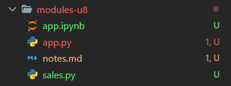
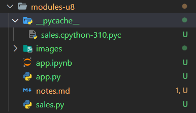
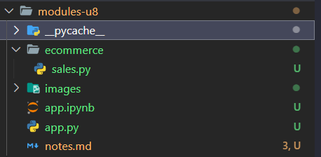
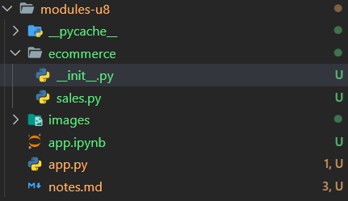

# 8-Modules

## 1- Creating Modules

We have the following classes:

```python
#File: app.py
def calc_tax():
    pass
def calc_shipping():
    pass
```

And we want to relocate this classes in a file called sales.py

```python
#File: sales.py
def calc_tax():
    pass
def calc_shipping():
    pass
```

Now we want to use the code inside the _sales_ module.

There are two ways of doing this:

- Option #1

```python
from sales import calc_shipping

calc_shipping()
```

If we want to import several methods we can use a _comma_.

```python
from sales import calc_shipping, calc_tax

calc_shipping()

calc_tax()
```

- Option #2

```python
import sales 

sales.calc_shipping()
```

## 2- Compiled Python Files

In this folder we have the following folders:



If we run the _app.py_ program this will create a new folder:



In this new folder (`__pycache__`) we a list of the modules that we import into our program.
So currently we have the compiled version of the sales module.

The reason of why python stores these compiled files in this stored folder is to speed up  module loading. So next time we load our program, python will look at the content of this folder, and if we do have the compiled version of the module, python will simply load that compiled version.

## 3- Module Search Path

When we use `import` in python, python will look for the .py file.
So if for example we have somthing like:

```python
import sales
```

Python will look for a file called _sales.py_.

I f we use the following `sys.path` python will give us an array with the multiple paths to find a module.
The first element in this array represents the current folder.

So when python sees an import statement, it will search all thesedirectories to find this module. As soon asit finds the module, our search stops there.  

## 4- Packages

Currently all out files or modules are in this folder, but as our application grwos, we probably want to organize this calss into sub directories, otherwise we''ll end up with hundreds or even thousands of python files or even python modules in one folder, that is not good.


To avoid this kind of situation we can create sub directories.

For tis example we are going to a subdirectory called ecommerce and move the _sales.py_ file to this folder.



After doing this if we try to use the `import sales` in the _app.py_ file, we are going to get an error.

To avoid this error, it is necessary to create a new file:



When we add this file here, python would treat the ecommerce folder as a package. So a package is a container for one or more modules. In the system terms, the package is mapped to a directory and a module is mapped to a file. So, now we can go back to _app.py_ and prefix the name of this module with the name of its package that is `ecommerce.sales`

```python
import ecommerce.sales
```

Now to use any of the objects in the sales module, we need to prefix them with the name of their package and module.

```python
import ecommerce.sales

ecommerce.sales.calc_tax()
```

This syntax can make our code a litte bit noisy. So instead of this we can try something like this:

```python
from ecommerce.sales import calc_shipping

calc_shipping()
```

Or this other approach:

```python
form ecommerce import sales

sales.calc_shipping()
sales.calc_tax()
```