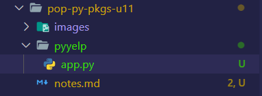
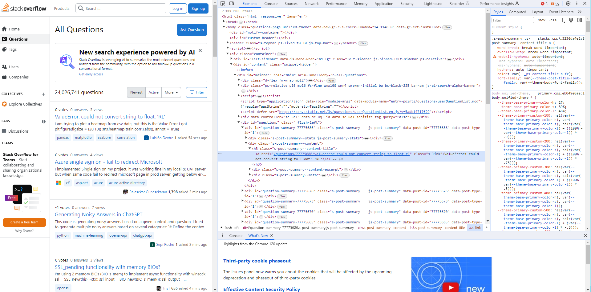

# Popular Python Packagaes

## 1- Introduction

In this unit we are goin to learn how to work with Excel Spreadsheets, PDFs, Sending Text, Browser Automation, Web Scraping, etc...
And this with the help of some packages.

## 2- What are APIs?

Mosst of the Web Pages make their data available with the help of the APIs (Application Programming Interfaces).

These APIs are endpoints that are publicly accessignle on the internet, so they have URL's just the websites themselves.

Here is an example.

From the **YELP** web page we have this API

```txt
GET https://api.yelp.com/v3/businesses/search
```

We can send an http request to this point to get a list of businesses that match some criteria.

## 3- Yelp API

There is a [Web Site](https://www.yelp.com/developers) in which we can find the the REST (Representational State Transfer) API used by YELP. This inside the **Yelp Fusion** section.

RESTI API is basically a bunch of conventions of rules and conventions that we have to follow to build or consume API's for exchanging data.

In this other [link](https://docs.developer.yelp.com/docs/fusion-intro) we can find the documentation about the API's used by Yelp Fusion.

For working with businesses for example we have endpoint for finding businesses by keyword, location, category or using a phone number, we also have an endpoint for getting details that we want for a particular business, or reviews, these are all business endpoints.

To get started we first need to create an app.

After we crete the app, we will have a client ID that uniquely identifies our application. This is like a user name for an application. We also have an API key, whicj is kind of like a password fo an application, we will lend this API key wheveer we want to talk to any of endpoints on Yelp, this is for security.
So Yelp wants to know who's calling theri API endpoints. With this basic information that we've provided at least we have contact information.

## 4- Searching for Businesses

We are going to start by creating a new project called **PYYELP**



Now let's open up the terminal window and using pipenv install the requests package.

Before installing the packages , we need to install `pipenv`:

```bash
pip install pipenv
```

And after this we can install the requests package.

```bash
pipenv install requests
```

We use this package to send http requests.

```python
import requests

url = "https://api.yelp.com/v3/businesses/search"
api_key = "Dy6YtUIGTCaDBoUFuYJLU9HwOKqvPGQ579ky53jC4ffztIdFEQC_a2S9oqTrjQEbGJe3jNmwHcPLAuVJHzKlBK2poVgCaXiX5j-s8PlwE-omYdhYLjUfkmeIhCkeZXYx"
headers = {
    "Authorization":"bearer " + api_key
}
params = {
    "term":"Barber",
    "location":"NYC"
}
response = requests.get(url=url,headers=headers,params=params,verify=False)#False is used to fix an issue

#print(response.text)

result = response.json()
businesses = response.json()["businesses"]

for business in businesses:
    print(business["name"])

names = [business["name"] for business in businesses if business["rating"] > 4.5]

print(names)
```

It was necessary to add the `verify` parameter to avoid problems with the authentication.

## 5- Hiding API Keys

In the previous implmentation was stored the API key in the source code. There is a problem with this. If this code is added, to a version control system like git and publish in Github, this API key is visible to anyone who has access to that Github repository and that means they can create an application, a malicious application and use the API key to pretend to be us. That's not good. So if they violate any of the policies of Yelp, we'll be in trouble.

So to prevent this, it is necessary to extract the API key from the code and put itin a separeate file, and execute that file from git. Here is how:

1. Create a new file called _config.py_. In this file we'll have all kinds of configuration parameters for our application

2. Move the _API_ to the _config.py_ file

3. Include the `api_key` variable importing it from the _config.py_ module.

4. Exclude this from git. By adding _config.py_ file to the _.gitignore_ file.

## 6- Sending Text Messages

[Twilio](www.twilio.com) is a very popular communication platform for adding voice, video and messaging to your applications. For example, you can quickly make and receive video calls, send text messages and this is parituclary useful for confirming reservations, sending appointment reminders ot promotions, the possibilities are endless.
They provide an API is perfectly documented and super easy to use. So, we can directly communicate with this API by sending an http requets using the request model. But you they also provide a library that we can install using pip or pipenv this library is essentially a wrapper around the API so it gives us objects and these objects encapsulate all that http communication. So we no longer have to work at a low level of sending http requests to twilio API. We work at ahigher level and more abstract and simplified fashion.

There are objects, these objects have methods, we call them and they in turn, will take care of sending the right http requests to Twilio API. The first thing to do is create a Twilio account.

After creating the account we cereate phone number using the web page. Once we hve the number we can do the following:

1. Create a new project and called "PyText"

2. Create an app to send messages

```python
from twilio.rest import Client

client = Client(account_sid,auth_token)
client.messages.create(
    to="+50688473578",
    from_="+16562184241",
    body="Hello Mate"
)
```

## 7- Web Scraping

Not every website has an _API_ for us to work with. So in situations like that, the only way to tge the data we want is to parse the HTML behin the web page, get rid of all the HMTL tags, and extract the actual data, this technique is called **Web Scraping**. So we scrape all the html tagas and get hte actual data that we want.
In this lecture we are going to write a program that will extract a list of new list questions on stack overflow.com. We refer to this kind of program as a Web crawler or a Web Spider.
For this we are going to create a new project (folder) called _PyCrawler_.

In this new project we are going to install the following package:

```bash
pipenv install beautifulsoup4
```

This is a very popular Python package for extracting information from HTML and XML files.

We also need to install the requests module to download the Web page that contains the newest questions from Stack Overflow.

```bash
pipenv install requests
```

After this we create a file called _app.py_. So the first step is to download the Webpage that contains the newest questions.
(check the _app.py_ to read more about the next steps.)

If we right click on the first question and select inspect it, we are going to see something like this:



In here we have an anchor that containts the title of our first question. There is a `div` with and `id="questions"`. This is the container for all our questions. So using out soup object, we need to find all elements, for the class `s-post-summary--content-title`. And that's pretty easy.
Please take a look at the code. 
Each element from the `questions` list is of the type _bs4.element.Tag_.

```python
questions = soup.select(".s-post-summary--content-title") # This returns a list and works as css selector
print(type(questions[0]))

#Output: <class 'bs4.element.Tag'>
```

If run the following code we are going to have access to different attributes of the css class.

```python
questions = soup.select(".s-post-summary--content-title") # This returns a list and works as css selector

print(questions[0].attrs)

#Output: {'class': ['s-post-summary--content-title']}
```

The Output is a diccitionary with the different values used in the `s-post-summary--content-title` class.

## 8- Browser Automation

**Selenium** is a tool that can automate the browser. So we can write a bunch of scripts to test various functions on a website. 
In this lecture we are going to use **Selenium** to automate the login process in Github and be sure that the process worked.

First we create a new project called _PySelenium_. For this project we follow the next steps:

1. Create the virtual environment: `python -m pipenv shell`
2. Download _pipenv_: `pip install pipenv`
3. Download the **Selenium**: `pipenv install selenium`

Next, we need a driver. A drier is a piece of software to automate a specific browsr, for all these popular browsers like Chrome, Firefox and son on, we have a web driver that we need to manually download.

So we head over to [pypi.org](https://pypi.org/) and search for **Selenium**. In the drivers section we can find the different drivers that can be download it ([Selenium website](https://pypi.org/project/selenium/)).

We select the driver for Chrome and download the _.zip_ file for Windows. And after downloading the file we move it to the C: folder.

Now we use the following peace of code to acces to the github webpage

```python
from selenium import webdriver
import time #This is go give us time to see what is happening with the 
            # Browser
browser = webdriver.Chrome()
browser.get("https://github.com/")
time.sleep(5) #Let us actually see something
```

After this we need the script to select the "Sign in" option. We can find elements by theri id, class, name and tag. So if we inspect this element, we should find an anchor with some classes but none of this classes uniquely identifies this link, because some of then are used in other places.

So for this case the onl way to find this element it is by its text.

For this it was necessary to import `By`

```python
from selenium import webdriver
from selenium.webdriver.common.by import By
import time #This is go give us time to see what is happening with the 
            # Browser
browser = webdriver.Chrome()
browser.get("https://github.com/")
time.sleep(5) #Let us actually see something

#Section of the code to find element
signin_link =  browser.find_element(By.LINK_TEXT,"Sign in")
signin_link.click()
time.sleep(5) #Let us actually see something
```

And with little more of code we can insert the user and the password to enter the Github account:

```python
from selenium import webdriver
from selenium.webdriver.common.by import By
from selenium.webdriver.common.keys import Keys
import time #This is go give us time to see what is happening with the 
            # Browser
browser = webdriver.Chrome()
browser.get("https://github.com/")
time.sleep(1) #Let us actually see something

#Section of the code to find element
signin_link =  browser.find_element(By.LINK_TEXT,"Sign in")
signin_link.click()
time.sleep(1) #Let us actually see something

#Section to introduce the user
username_box = browser.find_element(By.ID,"login_field")
username_box.send_keys("e-mail@email.com")

#Section to introduce the password
password_box = browser.find_element(By.ID,"password")
password_box.send_keys("PaSsWoRd")
password_box.submit()
time.sleep(5) #Let us actually see something
```

To be sure that the code worked, we can created an assertion that checks the user name:

```python
from selenium import webdriver
from selenium.webdriver.common.by import By
from selenium.webdriver.common.keys import Keys
import time #This is go give us time to see what is happening with the 
            # Browser
browser = webdriver.Chrome()
browser.get("https://github.com/")
time.sleep(1) #Let us actually see something

#Section of the code to find element
signin_link =  browser.find_element(By.LINK_TEXT,"Sign in")
signin_link.click()
time.sleep(1) #Let us actually see something

#Section to introduce the user
username_box = browser.find_element(By.ID,"login_field")
username_box.send_keys("e-mail@email.com")

#Section to introduce the password
password_box = browser.find_element(By.ID,"password")
password_box.send_keys("PaSsWoRd")
password_box.submit()
time.sleep(5) #Let us actually see something

#Section of the code to check user
assert "edjose182" in browser.page_source
```

If the user is not found, python will show an Exception.

We can use this other type of assertion to be more specific:
```python
profile_link = browser.find_element(By.CLASS_NAME, "Truncate-text")
link_label = profile_link.get_attribute("innerHTML")
print(link_label)
assert "edjose182" in link_label #This is not working
```

## 9- Working with PDFs

We create a new project called "PyPdf" and install some packages:

1. pip install pipenv
2. python -m pipenv shell (This creates the enviroment)
3. pip install pipenv
4. pipenv install pypdf2

I'm having problems with this lecture. The library used for the lecture is not working as expeceted.

I will move to the next one and try to find a way to implement this.

## 10- Working with Excel Spreadsheets

We create a new project called "PyExcel", download the _transactions.xlsx_ file and install some packages:

1. Create the virtual environment: `python -m pipenv shell`
2. Download pipenv: `pip install pipenv`
3. Download the Excel package: `pipenv install openpyxl`

Now when working with spreadsheets, we need to start with a workbook object,we can even create an empty workbook in memory, or load an existing workbook on disc. _openpyxl_ has a workbook class and you can create a new workbook with it.

```python
import openpyxl

wb = openpyxl.Workbook()
```

We also have the `load_workbook` function for loading an existing workbook.

In this demos we are going to load the _transaction_ file.

We can use this the packages to get a list with the names of the sheets.

```python
import openpyxl
wb = openpyxl.load_workbook("transactions.xlsx")
print(wb.sheetnames)
```

For this example we only have one sheet and it's called "Sheet1".

Now we can create a _sheet_ object:

```python
import openpyxl
wb = openpyxl.load_workbook("transactions.xlsx")
print(wb.sheetnames)

sheet = wb["Sheet1"]
```

Next we need to access an individual cell or a range of cells and that is pretty easy.
So using square brackets, you can pass the coordinate of a cell.

Let's say for example _A1_ (Column A, Row 1).

```python
import openpyxl
wb = openpyxl.load_workbook("transactions.xlsx")
print(wb.sheetnames)

sheet = wb["Sheet1"]

cell = sheet["a1"]
```

`cell` is an object that has multiple attributes, E.g. Value, row, colum, coordinate, etc...

```python
import openpyxl

#wb = openpyxl.Workbook()

wb = openpyxl.load_workbook("transactions.xlsx")
print(wb.sheetnames)

sheet = wb["Sheet1"]

cell = sheet["a1"]
print(cell.row) #Prints the row number : 1
print(cell.column) #Prints the column number :1 
print(cell.coordinate) #Prints the position of the cell: A1
```

There is another way to access the information and this is by using a shet object, so instead of creating a new object, we can use the sheet. 

Instead of using square bracket to pass the coordinate, we can call the `cell` function and pass the row and the column.

```python
import openpyxl

wb = openpyxl.load_workbook("transactions.xlsx")

cell = sheet.cell(row=1,column=1)
```

This second approach is useful if we are iterating over all th rows and columns and you want to dynamically access various cells.

Here is an example.

First, we can use `max_row` and `max_column` to get the total number of rows and columns used by the Excel file. Oce we have this value we can iterate between the different rows and columns.

```python
import openpyxl

wb = openpyxl.load_workbook("transactions.xlsx")

sheet = wb["Sheet1"]

for row in range(1,sheet.max_row+1):
    for column in range(1, sheet.max_column +1):
        cell = sheet.cell(row,column)
        print(cell.value)
```

Here is the output:

```text
transaction_id
product_id
price
1001
1
5.95
1002
2
6.95
1003
3
7.95
```

But we can also use square brackets to access a range of cells.

```python
import openpyxl

wb = openpyxl.load_workbook("transactions.xlsx")

sheet = wb["Sheet1"]

sheet["a"] #This will return most all the cells in the "a" column
```

We can also work with an arrange of columns:

```python
import openpyxl

wb = openpyxl.load_workbook("transactions.xlsx")

sheet = wb["Sheet1"]

columns = sheet["a:c"] #This will return most all the cells in the "a" column

print(columns)
```

Here are some methods that we should be aware of. One of them is append, and we use that to add a row at the end of this sheet.

```python
import openpyxl

wb = openpyxl.load_workbook("transactions.xlsx")

sheet = wb["Sheet1"]

sheet.append([1,2,3])
```

Now let's save this workbook.

```python
import openpyxl

wb = openpyxl.load_workbook("transactions.xlsx")

sheet = wb["Sheet1"]

sheet.append([1,2,3])

wb.save("transactions2.xlsx")
```

## 11- Command Query Separetion Principle

This principle states that our methods or function should either be commands that perform an action to change the state of a sstem or queries that return an answe to the caller without cahnging the state or causing side effects. So our methods should either be commoand or queries but not both.

Let's see this principle in action. So in the last lecture that the `workbook` object has a method called create sheet.

```python
wb.create_sheet()
```

This is an example of a command method, because it's responsible for pperforming a task. The task of creating a sheet. As a result of calling this method, the state of our system, in this case, our workbook, changes, so everytime we call it we get a new sheet in this workbook. Now lest take a look at an example of query effect.

```python
import openpyxl

wb = openpyxl.load_workbook("transactions.xlsx")

sheet = wb["Sheet1"]

sheet.append([1,2,3])

wb.save("transactions2.xlsx")
```

So above we have this sheet that represents the first sheet in the workbook, in the last lecture you learned about the `cell` method, you cab use it to access a cell in a sheet. This is an example of a query method.

```python
import openpyxl

wb = openpyxl.load_workbook("transactions.xlsx")

sheet = wb["Sheet1"]

sheet.cell()

wb.save("transactions2.xlsx")
```

We use it to acess a given cell. However, this method violates the command query separation principle. Lets see why.

If we write a loop to print the value of all the sales in the first column.


```python
import openpyxl

wb = openpyxl.load_workbook("transactions.xlsx")

sheet = wb["Sheet1"]

for row in range(1,10):
    cell = sheet.cell(row,1)
    print(cell.value)
```

Here is the output:

```text
transaction_id
1001
1002
1003
None
None
None
None
None
```

Now after the for loop we are going to add new values using the `append()` method.
And finally save the workbook as "transactions3.xlsx"

The values that included are shown in the last position of the sheet. (Row 10) and not in after the existing values in the sheet.

This is th result of violation of command query separation principle. 

Here is the reason. In the for loop, we're iterating over the first 10 rows to get the cell in the first column. Now in the original spreadsheet, we only had 4 rows, these are the rows, so the heading row followed by 3 data rows. So when we use the for loop to iterate over the first 10 rows, the cell method magially created new cells. In other words, when we call this method (the `cell` method) to access a cell at a gien coordinate. If that cll doesn't exist, this method will create it for us, and this is a violation of command query separation principle, because this is a query method, so it should not change a state or a system, in this case a workbook.

So in other words, we should not have a side effect. So the developer who implemented this method probably had no idea of this very important principle in programming.

So as we can see the violation of this principle can create unexpected issues in our program. It makes it hard to reason about our code and figure out what is happening.

## 12- NumPy

We create a new project called "Numpy" and install some packages:

1. Create the virtual environment: `python -m pipenv shell`
2. Download pipenv: `pip install pipenv`
3. Download the Excel package: `pipenv install numpy`

So numPy use Python by bringing super fast multi dimensional arrays that take less memory that uild in lists python. So anytime you want to work with large, multi dimesional arrays, numPy is the vers choice. 

We can use the `array` function to create our multi dimensional arrays.

We can pass a normal list:

```python
import numpy as np
np.array([1, 2, 3])
```

And this will return a numPy array. 

```python
import numpy as np
np.array([1, 2, 3])
print(array)
print(type(array))
```

This is the output that we got.

```text
[1 2 3]
<class 'numpy.ndarray'>
```

Our array is of the type _numpy_.

Now lets create a multi dimensional array:

```python
import numpy as np
array = np.array([[1, 2, 3],[4, 5, 6]])
print(array)
print(type(array))
```

This is the Ouput, a Matrix with two rows and 3 columns:

```text
[[1 2 3]
 [4 5 6]]
<class 'numpy.ndarray'>
```

This type of class has an attribute called `shape` and it used to show the dimesions of the Matrix.

```python
import numpy as np
array = np.array([[1, 2, 3],[4, 5, 6]])
print(array.shape) #prints: (2,3)
```

This packages has a lot of useful methods that we can use to make things easier:

For example, we can initialize an array with only zeros:

```python
import numpy as np

array_zeros = np.zeros((3,4))

print(array_zeros)
```

Output:

```text
[[0. 0. 0. 0.] 
 [0. 0. 0. 0.] 
 [0. 0. 0. 0.]]
```

By default all the numbers are set as floating but we can change this,, we can pass the data type that we want to use to the function:

```python
import numpy as np

array_zeros = np.zeros((3,4),dtype=int)

print(array_zeros)
```

The otuput is:

```text
[[0 0 0 0]
 [0 0 0 0]
 [0 0 0 0]]
```

There is a another method called `ones` and can be used to create a Matrix with only ones:

```python
import numpy as np

array_ones = np.ones((3,4),dtype=int)

print(array_ones)
```

The output is:

```text
[[1 1 1 1]
 [1 1 1 1]
 [1 1 1 1]]
```

We can also create an array with a specific number that we want it to use:

```python
import numpy as np

array_full = np.full((3,4), 5 ,dtype=int)

print(array_full)
```

The output is:

```text
[[5 5 5 5]
 [5 5 5 5]
 [5 5 5 5]]
```

There is also a mehtod to create an array with random values:

```python
import numpy as np

array_rand = np.random.random((3,4))

print(array_rand)
```

Here is the output:

```text
[[0.73906328 0.22790135 0.68248483 0.43806384]
 [0.08788784 0.03936695 0.7191194  0.21008655]
 [0.20145095 0.6797499  0.12378291 0.9378971 ]]
```

Now we can access the different elements of the array by using the index:

```python
import numpy as np

array_rand = np.random.random((3,4))

print(array_rand)
print(array_rand[0,0])

```

The output is:

```text
[[0.9303379  0.28942505 0.21458711 0.73563189]
 [0.69782706 0.59446942 0.55578635 0.60832952]
 [0.39800902 0.94947773 0.97450411 0.13648845]]
0.930337903308149
```

Something that we can do with the numpy is carry out different actions with the Matrix. Here is an example:

```python
import numpy as np

array_rand = np.random.random((3,4))

print(array_rand)
print(array_rand > 1)
```

```text
[[0.6542974  0.38948026 0.78897482 0.26271316]
 [0.31404506 0.07583382 0.62116149 0.10681876]
 [0.46432461 0.73066759 0.88541936 0.11012045]]
[[False False False False]
 [False False False False]
 [False False False False]]
```

NumPy arrays supports various kinds of mathematical operations. We can also use boolean expressions, here is an example:

```python
import numpy as np

array_rand = np.random.random((3,4))

print(array_rand)
print(array_rand[array_rand > 0.2])
```

```text
[[0.89459067 0.67029409 0.48428199 0.19752728]
 [0.29270503 0.85615365 0.63262512 0.6252742 ]
 [0.05489593 0.96001134 0.78742268 0.69065507]]
[0.89459067 0.67029409 0.48428199 0.29270503 0.85615365 0.63262512
 0.6252742  0.96001134 0.78742268 0.69065507]
```

This returns a new array, with only the values that are greater than 0.2.

There also methods what will let use to peform calculations.

```python
import numpy as np

array_rand = np.random.random((3,4))

print(array_rand)
print(np.sum(array_rand))
```

```text
[[0.85354685 0.02182408 0.12298758 0.17832534]
 [0.12313617 0.38095086 0.54739048 0.83697437]
 [0.38199189 0.61902512 0.88005825 0.21735751]]
5.163568509038422
```

This returns the result of the sum of all the values in the Matrix.

NumPy provides multidimensional arrays that are super fast and take less memory, plus they support various kinds of mathematical operations that regular python lists don't.