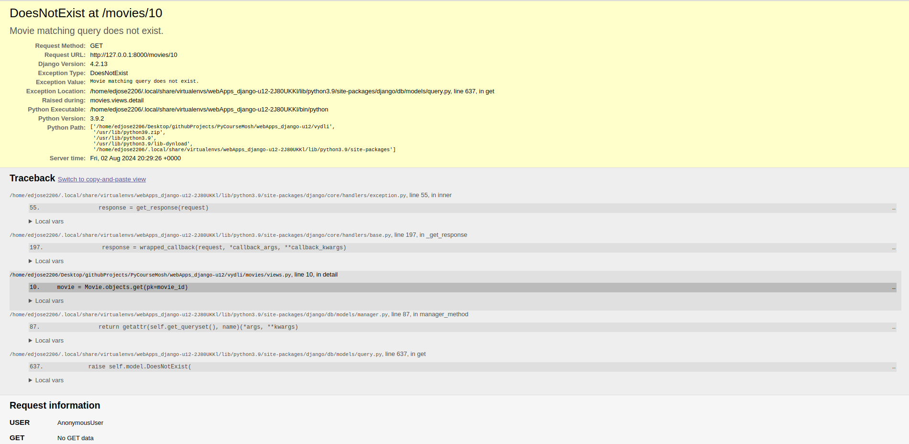

# Building Web Applications with Django

## 2- Your first Django Project

First, we create a folder called "vidly". Now in here we are going to install _Django_.

1. `pip install pipenv`
2. `python -m pipenv shell`
3. `pip install pipenv`
4. `pipenv install django==2.1`

Next we are going to use a tool called _django admin_ for creating a new django project.

Here is the command: `django-admin startproject vidly .`

_Django admin_ created a vidly directory as well as a _manage.py_ file. We use _manage.py_ to perform some administrative tasks such as tarting our web server or migrating our database, populating it with data and so on.

Now in the "vidly" directory that was created is essentially the core of a project. It has a bunch of settings and that's where everything gets started. So we have _init.py_, this tells python to treat this directory as a package.

Bwllow that we have _settings.py_ and in this file we have various configuration settings for our project, next we have _urls.py_ and this is where we define various **URLs** endpoints for our applications, and finally we have _wsgi.py_  which is short forWeb Server Gateway Interface. The purpose for this file is to represent the standard interface between application written in python and web servers. That is an advane topic and goes beyond the scope of this course. 

Now we are going to use _manage.py_ to initialize the web server.

(To install pylint, we can use the following command: `pipenv install pylint --dev`)

To do this we are going to run _manage.py_: `manage.py runserver`

After this we can see that the server is running on port 8000: http://127.0.0.1:800/

And we can stop it at any time by pressing Control C

If we go to the created URL we should be able to see the following:


That means that our first Django project is working.

## 3- Your First App

In Django a project can contains multiple apps, and this apps don't represent that entire application, they represent a small part of an application that is focused on one functional area.


For example let's say we are going to build a website like Amazon. Amanzon has a lot of different functional areas such as:


Each functional area includes a bunch of highly related function. So with this architecture we could beak down a large complex project into a smaller, more manageable and more maintainable apps. Also, we can reuse these apps in other _Django_ projects. For example, we can build an app that represents a blog and then reuse this app in any website that needs a block.

In this lecture we are going to create an app called movies. And this app will have all the funcionalities for displaying the list of the movies, as well as the details of a given movie.

First we run `python manage.py startapp movies`. This created a new directory called "movies". In this directory we have the following:

1. _migrations_ folder.
2. _\_\_init\_\_.py_: This tell python that this is a package, so pontentially in the future we can distribute this package in pypi.org.
3. _admin.py_: This is where we define how the admistration are for managing the movies will look like.
4. _apps.py_: This file is a little bit confusing becase here we are in within the boundary of one app.

   So why do we have a file called _apps.py_? Basically we use this to store various configuration settings for this app.
5. _models.py_: Here we define classes that represent the domain of this app. For example, in the domain of movies we could have classes like movie, genre and so on.
6. _tests.py_:This is where we write automated tests for this app.
7. _views.py_: This is where we define out view function.

   View in short is a function that takes a request on the terms of response.

### MVC architectural pattern

In this [link](https://www.geeksforgeeks.org/mvc-design-pattern/) there is a description of **MVC architectural pattern**. Here is the diagram showed in the lecture:


DJango uses the Model-Tempalte-View (**MVT**) structure.

## 4- Views

Now we are going to create the **view function**. In the _movies_ folder we are going to open up _views.py_. And in here we define a function called index.

This name is arbitrary, cd lt anything but usually we the word index for naming the function that represents a main page of an app.

```python
from django.shortcuts import render

def index(request):
    pass
```

Now, all our view functions should take the parameter called _request_ , again the name is arbitrary, but the object that is passed to this function is an http request object. We are not goin to call this function, Django will take care of doing this. So when we send an http request endpoint, Django, will figure out based on some configuration what the function should be called.

Now in every view function we should return an http response. So, on the top it is imported the http response class from Django http module.

```python
from django.http import HttpResponse

from django.shortcuts import render

def index(request):
    return HttpResponse("Hello World!")
```

And this is our first _view_, now we need to map this to the URL. So back in the movies app, let's add a new file, by convention the name of this file should be _urls.py_.

In this file we are going to create a variable called `urlpatterns` that we should set to a list, again, this is one of the conventions that Django expects us to follow.

And in this list we add objects that map URL endpoints or view functions. And for that we use the path function in Django. So, on the top from Django URLs.

Here we are going to use an empty string, and this will represent the root of this app. For example, in our movies app, we are going to have some URL endpoints like this:

- movies/
- movies/1/details

So here an empty string represents the root of this app.

```python
from django.urls import path

from . import views #It is better to do it in this way because
                    #someone can use a different path

urlpatterns = [ #This is the URL configuration
    path('', views.index,name='index')
]
```

So we are done with configuring URLs but our main app, the Vydli app, has no knowledge of the movies app. So if head over to local host.

So we need to go to the main app (Vydli) and this folder we have an _urls.py_ that defined the URL configuration for our main app.

```python
# Path of the file: vidly/urls.py
from django.contrib import admin
from django.urls import path

urlpatterns = [
    path('admin/', admin.site.urls),
]
```

Now we need to include the movies URLs to the main URL:

```python
from django.contrib import admin
from django.urls import path, include

urlpatterns = [
    path('admin/', admin.site.urls),
    path('movies/',include('movies.urls'))
]
```

## 5- Models

The next step is to create the models for this _movies_ app. These models are python clasesses that we use to represent our application data.

So here in our movies ap, we are going to have models like genre and movie.

Now we are going to create them. Here in the _movies_ directory let's open up _models.py_. Here we are going to create a class called **Genre** and we should direct this class from `models.model` 
So in Djando we have this package `django` and this package encapsulates all the functionality around working with databases. Now in this package we have a module called `models` and in this module we have a class called model.

This class encapsulates a lot of functionality who is stroring a model object in the database, or retrieving model objects, filter them and so on.

So by enheraince our class from the base model class in Django. Our genre class will also iherit all the functionality, which means we don't really have to write any code to store genre objects in a database. Django will automatically take care of that. 


With `on_delete` we tell Djang what should happen when a genre is deleted. For example, if you have a genre called comedy. And we have 5 movies in this genre, what should happen if we accidentally or deliberately delete the comedy genre? All the movies associated to this genre will be deleted.

## 6- Migrations

So we have created our model calsses, now we should be able to store our model objects in a database. In the project there is a file called: _db.sqlite3_. This is a blank sqlite database that Django automatically created for us. SQLite is avery simple light weight database that we ofen use in small applications like applications that we run in mobile devices. But it's not suitable in an enterprise with applications that is supposed to serve thousands or even millions of users.

We need to create Tables to be able to store data in database. Having said that, when using Django, we don't have to manually design these tables. We can have Djando automatically create them for us based on our models. So every time we create new model classes.

So everytime we created model classes or modify existing ones, we tell Django to compare our model classes with our database. Django will look at out database, it will figure out what tables and columns we have, then it will calculate the difference between our model classes and our database tables. And based on that it will create a migration.

A migration is essentially a python file, that includes some code, when we run that, it will synchronize our database with out model classes.

So if we open a terminal window and run `python mange.py makemigrations` it will tell us there are no changes and this is because Django is not aware of our model classes. So the first step is to register our movies app with Django. 

In our project, inside the _vidly_ package we open the _settings.py_ file. 

This file has the configurations to be use by our project and one of them is the **INSTALLED_APPS**.

The first one is admin, and this creates and administration pattern for us.

We have auth, which is the authentication framework. With this we'll be able to authenticate users and  see if they have permissions to perform various tasks.

We have content types which is a framework for creating generic classes within model classes.

Below that we have the sessions app, which is a framework that allows us to temporarily store data above the current user.

Next we have the messaging framework, and we use that in situations where let's say the user creates a new movie and then we redirect them and display the message like, the movie was successfully created.

And finally we have static files, which is used for managing static files like css files, images, so on.

Now on moost applications, we need pretty much all these install apps, but if you don't need any of these apps in your application you can simply come back here and delete that app.

For this demo, we need to register the movies app here, so Django can keep track of our model classes in that app.

In the movies folder, here we have the file _apps.py_. In here we can have various configuration settings, for the movies app. In the class `MoviesConfig`, this class is in the apps module of the movies package, so to register the movies app with Django we need to provide the complete path to this class. So now we go back to _settings.py_, here we add movies:

```python
INSTALLED_APPS = [
    'django.contrib.admin',
    'django.contrib.auth',
    'django.contrib.contenttypes',
    'django.contrib.sessions',
    'django.contrib.messages',
    'django.contrib.staticfiles',
    'movies.apps.MoviesConfig'
]
```

Now we are going to run `python manage.py makemigrtions` one more time:

```txt
Migrations for 'movies':
  movies\migrations\0001_initial.py
    - Create model Genre
    - Create model Movie
```

This time Django detected that there are some changes in the movies app, so it created a migration that is inside movies/migration/0001_initial.py. Let's have a quick look at this migration. 

```python
# Generated by Django 2.1 on 2024-06-20 00:19

from django.db import migrations, models
import django.db.models.deletion


class Migration(migrations.Migration):

    initial = True

    dependencies = [
    ]

    operations = [
        migrations.CreateModel(
            name='Genre',
            fields=[
                ('id', models.AutoField(auto_created=True, primary_key=True, serialize=False, verbose_name='ID')),
                ('name', models.CharField(max_length=255)),
            ],
        ),
        migrations.CreateModel(
            name='Movie',
            fields=[
                ('id', models.AutoField(auto_created=True, primary_key=True, serialize=False, verbose_name='ID')),
                ('title', models.CharField(max_length=255)),
                ('release_year', models.IntegerField()),
                ('number_in_stock', models.IntegerField()),
                ('daily_rate', models.FloatField()),
                ('Genre', models.ForeignKey(on_delete=django.db.models.deletion.CASCADE, to='movies.Genre')),
            ],
       
```

There is a class called migration, and in this class we have a couple of operations for bringing our database up to date with the current model classes. So the first operation is for creating a Model (_Create\_Model_). We can see the name is set to genre, and here are the fills of the genre. So we have id and name.

Now in the code, we only specify the name field, we didn't add the id field. Django automatically takes care of that, so it ensures that every object has an id that uniquely identifies that object. Now similarly we have another create model operation for creating the movie table, in this table, we are going to have these fields:

- id
- title
- release_year
- number_in_stock
- daily_rate
- genre

This migration is not executed yet. It simply describes the operations that need to be performed to the database to bring it up to date with our current model classes.

So the next step is to run this migration. Before doing that, if we run `python manage.py runserver` we are going to see the following message:

```txt
You have 16 unapplied migration(s). Your project may not work properly until you apply the migrations for app(s): admin, auth, contenttypes, movies, sessions.
```

That basically means you have migrations that need to be executed. Now we run `python manage.py migrate` to apply the missing migrations in our database.
If we open the database, we can see we have a total of 13 tables. Each of these tables is prefixed with the name of the app that contains it. 

Here we can find the two tables for our movies app (genre and movie). So table names are in singular.


Of course this is done by convention and we can always override that in the future if we want to.

## 7- Changing the Models

Let's go through this workflow one more time. So here in the movies app, let's open up _model.py_.
Here's our movies class and we are going to add a new attribute called date "created"

```python
from django.db import models
from django.utils import timezone

# Create your models here.
class Genre(models.Model):
    name = models.CharField(max_length=255)

    def __str__(self):
        return self.name
    
class Movie(models.Model):
    title = models.CharField(max_length=255)
    release_year = models.IntegerField()
    number_in_stock = models.IntegerField()
    daily_rate = models.FloatField()
    Genre = models.ForeignKey(Genre, on_delete=models.CASCADE)
    date_created = models.DateTimeField(default=timezone.now)
```

It was necessary to import the timezone class and create a reference to the `timezone.now` method to get the date according to the timezone of the user.

Now we need to create a new migration, so in the terminal let's run: `python manage.py makemigrations`

```txt
$ python manage.py makemigrations
Migrations for 'movies':
  movies\migrations\0002_movie_date_created.py
    - Add field date_created to movie
```

Now we have migration number , let's take a quick look at this migration

```python
# Generated by Django 2.1 on 2024-06-20 00:58

from django.db import migrations, models
import django.utils.timezone


class Migration(migrations.Migration):

    dependencies = [
        ('movies', '0001_initial'),
    ]

    operations = [
        migrations.AddField(
            model_name='movie',
            name='date_created',
            field=models.DateTimeField(default=django.utils.timezone.now),
        ),
    ]
```

So here we have an operation of type `AddField`. So this operation is going to go to the movie table, an alterior field called `date_created` and this is how it's going to alter this field.

Now in the terminal we run `python manage.py migrate`

```txt
$ python manage.py migrate
Operations to perform:
  Apply all migrations: admin, auth, contenttypes, movies, sessions
Running migrations:
  Applying movies.0002_movie_date_created... OK
```

The second migration is applied and now in the _movies_movie_ table we can see the new field.

If we want to know which SQL commands are being use by python we can use the following command: `python manage.py sqlmigrate movies 0001` (movies is the app that we are interesting to migrate)

```sql
BEGIN;
--
-- Create model Genre
--
CREATE TABLE "movies_genre" ("id" integer NOT NULL PRIMARY KEY AUTOINCREMENT, "name" varchar(255) NOT NULL);
--
-- Create model Movie
--
CREATE TABLE "movies_movie" ("id" integer NOT NULL PRIMARY KEY AUTOINCREMENT, "title" varchar(255) NOT NULL, "release_year" integer NOT NULL, "number_in_stock" integer NOT NULL, "daily_rate" real NOT NULL, "Genre_id" integer NOT NULL REFERENCES "movies_genre" ("id") DEFERRABLE INITIALLY DEFERRED);
CREATE INDEX "movies_movie_Genre_id_4fca4315" ON "movies_movie" ("Genre_id");
COMMIT;
```

## 8- Admin

Alright, our database is in good shape. Now the next step is to allow the staff at our imaginary video store to populate the list of movies. So we need to create an administration panel for them.

However, when using Django, we don't have to do this manually. So all Django applications come with a powerful adminstration interface.

In the terminal we are going to run our development server `python3 manage.py runserver`

After running the command we are going to see the following:


In the URL we are going to add "admin"


This is the entrance to our adminstration panel.

So by default, we get this login screen, this is coming from the auth app that is installed by default. 

In the _settings.py_ file we can find the installed apps:

```python
INSTALLED_APPS = [
    'django.contrib.admin',
    'django.contrib.auth',
    'django.contrib.contenttypes',
    'django.contrib.sessions',
    'django.contrib.messages',
    'django.contrib.staticfiles',
    'movies.apps.MoviesConfig'
]
```

The second app is the _autho app_ and this the app that know everything about autheticating users. And the login screen is implemented inside of that app. SO as you can see, that app is a small reusable package that we are using in this project. By the same token we can create small, reusable apps that other people can use in their projects.

Now back to the login screen, currenlty we don't have any users in our database. So the next step is to create a super user. Now we are going to use another terminal so in that way in the main therminal the server can be running.

Now we are going to run the following command: `python3 manage.py createsuperuser`

Now we need to enter an user, an e-mail and password.

Now if we go to the login screen we can use the user and the password. Once everything is ready we are going to see the following window:


Now in here we can manage the list of groups nad users. SO we can put users in different groups like admins, moderators, guest and so on.

If click the users options, the window is going to shows us a table with all the users that has access.


Now, in the main page we can only manage hte users and groups. We cannot manage our custom models like genre and movies, but we can easily bring them here with only a single line of code.

In the _movies_ app (`PyCourseMosh/webApps_django-u12/vydli/movies/`) we have the admin file and this is where we register the models we want to manage using our administrative interface.

Now in this file we need to import our genre and movie classes.

```python
from .models import Genre, Movie

admin.site.register(Genre)
admin.site.register(Movie)
```

WIth this we are telling to Django to register these models in the administration interface.
Now we save the changes and in the main page we are goin to update the window.


Now we have the Genre and Movies models in our movies app.

## 9- Customizing the Admin

We can override the str magic method in the _Genre_ class.

In the movies app, let's open up _models.py_. And here we are going to find the _Genre_ class. In here we can override the str magic method to specify the string representation of a _Genre_ object. So let's define the `__str__` method.

```python
def __srt__(self):
    return self.name
```

We want to use the name of a genre to represent it as a string.

Now we are going to take this to the next level. Let's say you want to add another clomun. To see the _ID_ of each genre, for that we need to go to our movies app and open _admin.py_ module.

We previously registered the genre calss with admin, now to customize how we work with genres in our admin panel, we need to create another class called `genre_admin`. Now to customize the list of genres in admin, we need to create.

```python
#File: admin.py
class GenreAdmin(admin.ModelAdmin):
    list_display = ('id','name')

admin.site.register(Genre,GenreAdmin)
```

If we refresh the web page (http://127.0.0.1:8000/admin/movies/genre/) we can see that the table looks better now:


Now we can use the user interface to add a new genre.
I'm going to add Action and Comedy.

>**Info: Minor fix**
>
>There was a problem with the version that I was using of Django for Python. I was getting the error show here: [No such table:main.auth_user__old](https://forum.codewithmosh.com/t/no-such-table-main-auth-user-old/2415/3).
>
>I tried the next steps to fix the problem:
>
>1. Stopped the django webserver running, Ctrl-C
>2. Delete the db.sqlite3
>3. Uninstalled Django old verison
>4. Install latest version of Django with “pip install django”
>5. Install latest version of Django with “pipenv install django” 
>6. Issue “python manage.py makemigrations”
>7. Issue “python manage.py migrate”
>8. Create a superuser with “python manage.py createsuperuser”
>9. Issue “python manage.py runserver” (or port 8080)

Now the table looks like this:


In movies we don't anything yet. Now we are going to add a new movie using the interface.


Now the interface let us to select the date that new movie(s) is included but we can hide this.

To do this, we need to create a model admin for movies.

```python
#File: admin.py
class MovieAdmin(admin.ModelAdmin):
    exclude = ('date_created')
...
admin.site.register(Movie,MovieAdmin)
```

## 10- Database Abstraction API

Earlier was built a view function to respond to requests sent to this endpoint: _movies/_.


In the previous image is shown the message displayed.

Here we have the _movie_ class we created earlier. As you can see we derived this class from the model class in Django.

```python
class Movie(models.Model):
    title = models.CharField(max_length=255)
    release_year = models.IntegerField()
    number_in_stock = models.IntegerField()
    daily_rate = models.FloatField()
    Genre = models.ForeignKey(Genre, on_delete=models.CASCADE)
    date_created = models.DateTimeField(default=timezone.now)
```

But why? Because this model class gives us a bunch of methods for creating, retrieving, updating and deleting objects from our database. So if you want to store a movie object in our database, you simply call one of these methods in our database callaed **save**. The **save** method will internally take care of generating the right SQL statement to update our SQL database. This is what we call a "databse abstraction API". So this model class, gice us an API, which is short for Application Programming Interface, and this API, abstracts away the complexity of working with a database. Now let's see how to use this API to get the list of movie objects from our database.

So in our _movies app_, let's open up the _views_ module.

So here we have the index function taht we created earlier, currently we are returning "Hello World". Now we are going to use our model API to gent all the movie objects in our database. So first on the top, from the models module, in the current folder, let's import the movie class

```python
from django.http import HttpResponse
from django.shortcuts import render
from .models import Movie

def index(request):
    Movie.objects.all() #With this statement we get all the movie
                        #objects in our database
    return HttpResponse("Hello World!")
```

When we call `all` at some point Django is going to generate the SQL statement like this

```sql
SELECT * FROM movies_movie
```

We also have a method to filte records, so taht is `movie.objects`

```python
from django.http import HttpResponse
from django.shortcuts import render
from .models import Movie

def index(request):
    Movie.objects.all() #With this statement we get all the movie
                        #objects in our database
    Movie.objects.filter()
    return HttpResponse("Hello World!")
```

Here we can pass arbitrary keyword arguments like: give me all the movies with release year. 

So let's set `release_year` to 1084.

```python
from django.http import HttpResponse
from django.shortcuts import render
from .models import Movie

def index(request):
    Movie.objects.all() #With this statement we get all the movie
                        #objects in our database
    Movie.objects.filter(release_year=1984)
    return HttpResponse("Hello World!")
```

When we call this at some point Django is going to generate a SQL statement like this:

```SQL
SELECT * FROM movies_movie WHERE release_year ...
```

ALso we have methods to get a specific item:

```python
from django.http import HttpResponse
from django.shortcuts import render
from .models import Movie

def index(request):
    Movie.objects.all() #With this statement we get all the movie
                        #objects in our database
    Movie.objects.filter(release_year=1984)
    Movie.objects.get(id=1)
    return HttpResponse("Hello World!")
```

We aslo have methods for saving movie objects or deleting them from our database. So these methods represent our database abstraction API, that simplified a lot of cases. Now, sometimes we are going to deal with complex queries, if these methods don't do what we need, we can always send raw SQL statements for our database.

## 11- Templates

Now we are going to learn how to retun HTML from the view function.

In the top of the _views.py_ file we can see we are importing the `render` function. We use this function to render a template.

Now we can use this function to the information in a different way:

```python
from django.http import HttpResponse
from django.shortcuts import render
from .models import Movie

def index(request):
    movies = Movie.objects.all()
    return render(request=request,template_name='indec.html',context={'movies':movies})
```

Now we need to create the template. In the _Movies_ folder we are going to create a new folder called "templates". By default we should use this name because is the folder that Django uses by default.
Now we add the "index.html" file to this folder.

In the HTML we can use zen code to generate the HTML easier. Here is an example:

```html
table.table>thead>tr>th*3
```

After type this, we use tab to generate the rest of the code:

```html
<table class="table">
    <thread>
        <tr>
            <th></th>
            <th></th>
            <th></th>
        </tr>
    </thread>
</table>
```

Now after some changes we will have the follwing code:

```html
<!DOCTYPE html>
<!--[if lt IE 7]>      <html class="no-js lt-ie9 lt-ie8 lt-ie7"> <![endif]-->
<!--[if IE 7]>         <html class="no-js lt-ie9 lt-ie8"> <![endif]-->
<!--[if IE 8]>         <html class="no-js lt-ie9"> <![endif]-->
<!--[if gt IE 8]>      <html class="no-js"> <!--<![endif]-->
<html>
    <head>
        <meta charset="utf-8">
        <meta http-equiv="X-UA-Compatible" content="IE=edge">
        <title>This is my movie app</title>
        <meta name="description" content="">
        <meta name="viewport" content="width=device-width, initial-scale=1">
        <link rel="stylesheet" href="">
    </head>
    <body>
        <!--[if lt IE 7]>
            <p class="browsehappy">You are using an <strong>outdated</strong> browser. Please <a href="#">upgrade your browser</a> to improve your experience.</p>
        <![endif]-->
        <table class="table">
            <thread>
                <tr>
                    <th>Title</th>
                    <th>Genre</th>
                    <th>Stock</th>
                    <th>Daily Rate</th>
                </tr>
            </thread>
            <tbody>
                
                <tr>
                    <td>{{movie.title}}</td>
                    <td>{{movie.Genre}}</td>
                    <td>{{movie.number_in_stock}}</td>
                    <td>{{movie.daily_rate}}</td>
                </tr>
                
            </tbody>
        </table>


        <script src="" async defer></script>
    </body>
</html>
```
Here is important to point out that.

1. : It is used to write python code
2. {{}}: It is is used to declare variables.

## 12- Adding Bootstrap

In this lecture we are going to add boorstrap ou the Vidly application.

Here is the link to the Boostrap web page: [Bootstrap documentation](https://getbootstrap.com/docs/5.3/getting-started/introduction/)

Now in the movies template folder we are going to add a new one called "base". (This file hase the Bootstrap template)

In this file we are going to create a block to wrapper the things that we will like to have a specific format. Like this:

```html


```

Now on _index.html_ we are going to wrap the things that would like have the format that is used on the _base.html_ file.

Similar to this:

```html
        
        
        <table class="table">
            <thread>
                <tr>
                    <th>Title</th>
                    <th>Genre</th>
                    <th>Stock</th>
                    <th>Daily Rate</th>
                </tr>
            </thread>
            <tbody>
                
                <tr>
                    <td>{{movie.title}}</td>
                    <td>{{movie.Genre}}</td>
                    <td>{{movie.number_in_stock}}</td>
                    <td>{{movie.daily_rate}}</td>
                </tr>
                
            </tbody>
        </table>
        
```

We use `extends` to bring the things that we have on the _base.html_ file.

And after this we use `block content` to wrap the elements from the HTML to use this type of format.

## 13- Customizing the Layout

Now er are going to add a bootstrap validation form on the top. So on Bootstrap documentation, we are going to go to _Components_. In here we are going to select _Navbar_ and on this page we find various examples of a bootstrap navigation bar. We are going to use the simple navigation bar. Here is the link to the Bootstrap: [Navbar Bootstrap](https://getbootstrap.com/docs/5.3/components/navbar/).


Now in out _base.html_, right under body we are going to copy the navbar code:

```html
<nav class="navbar bg-body-tertiary">
  <div class="container-fluid">
    <a class="navbar-brand" href="#">Vidly</a>
  </div>
</nav>
```

With these change the web app looks better.

Now we are going to center the table.

Back on the _base.html_, we should wrap the content block inside of a main element with the container class, so with bootstrap. We want to create a main tag with the class container.

```html
<main class="container">
    
    
</main>
```

Here is the result that we got after these changes:


If we want to add vertical borders to the table we can do the following:

Back into the _index.html_, here is our table. And we are going to add another class,

```html
        <table class="table table-bordered table-hover">
            <thread>
                <tr>
                    <th>Title</th>
                    <th>Genre</th>
                    <th>Stock</th>
                    <th>Daily Rate</th>
                </tr>
            </thread>
            <tbody>
                
                <tr>
                    <td>{{movie.title}}</td>
                    <td>{{movie.Genre}}</td>
                    <td>{{movie.number_in_stock}}</td>
                    <td>{{movie.daily_rate}}</td>
                </tr>
                
            </tbody>
        </table>
```

## 14- Sharing a Template Across Multiple Apps

Imthis lecture we are going to learn how to sahre a base template across multiple apps.

Currently, on the **movies** app we have a _base_ template. But we want this to be use on multiple apps. To do to it, we need to move the template in higher place in the project. For this we are going to create a "Templates" folder on the root of our project and to this folder we are going to move the template that we created in the movies app.

Now, in the _index.html_ of the movie app we are going to update the reference that we were using to _base.html_.

Old:
```python
    
```

New:
```python
    
```

To indicate to Django where is the template we want to use, we need to specify it on the settings file.

## 15- URL Parameters

Now, the vidly application currently only displays the list of movies. It would be nice if you could clock on the movie and see it's details.

So, the first thing we need to do is define a URL that takes a parameter like "movies/1" where 1 is the id of the movie.

In our movies app let's open up _urls.py_, here we need to define a new url pattern. 

The Main URL module in our project hands off any URL's that starts with "movies/".

Let's take a look at this. We are going to open the _urls.py_ file located on the vidly folder.

```python
from django.contrib import admin
from django.urls import path, include

urlpatterns = [
    path('admin/', admin.site.urls),
    path('movies/',include('movies.urls'))
]
```

So we are telling Django that any URL pattern that starts with "movies/" should be handed off to the URL module in the Movies app. 

Now back to the Movies app. 

When we add the parameter `<movie_id>`, that represents an URL that looks like this> `movies/1`. Because all the URLs we're working with in this module, starts with "movies/".

Now we need to map this to the view function:

```python
urlpatterns = [ #This is the URL configuration
    path('', views.index,name='movies_index'),
    path('<movie_id>',views.detail,name='movies_detail')
]
```

As a good practice we all gave a name. These names are useful in situations where we have multiple references,to an URL. Let's say "/movies/1". Now for whatever reason, we decide to change this URL to something like this, let's say "old_system/movies/1".

If you have multiple references, multiple hardcoded references to the URL like this, then we'll have to update all those references to the new URL, so that's why we use these names in view. These names should uniquely identify URL's so in our templates, instead of hard coding these URL's we reference then with their names and in the future if you wnat to change a URL we can change it in a single place.

Also as a best rpactive, it's better to _name space_ the name.

Now we are going to create the `detail` function on the _views_ module on the Movies app.

```python
from django.http import HttpResponse
from django.shortcuts import render
from .models import Movie

def index(request):
    movies = Movie.objects.all()
    return render(request=request,template_name='movies/index.html',context={'movies':movies})

def detail(request,movie_id):
    return HttpResponse(movie_id)
```

There is a probelm with this, if we pass something like "a" or "b" as or ID parameter the app will accept these values like IDs.

So to avoid this we can use a type converter, like this:

```python
urlpatterns = [ #This is the URL configuration
    path('', views.index,name='movies_index'),
    path('<int:movie_id>',views.detail,name='movies_detail')
]
```

## 16- Getting a SIngle Object

We can use our movie model, to get the movie to the given id.

```python
def detail(request,movie_id):
    movie = Movie.objects.get(pk=movie_id)
    return render(request=request,template_name='movies/detail.html',content={'movie':movie})
```

Now we need to create the template. 
(The template can be found in the following path: `PyCourseMosh/webApps_django-u12/vydli/movies/templates/movies/detail.html`)

## 17- Raising 404 Errors

The application is working up to this point, but what if we pass an invalid movie ID. For example:

`127.0.0.1:8000/movies/10`

We ge the following error:



This is an exception of type does not exist, that is not good. So the common patterns to handle these situations is to return an http 404 error.

404 is the standard http error, that says the page or the resource we are looking for does not exist. So, to fix this problem, we need to handle this exception and return an http 404 error.

To do this we wrap this in a try block, and then catch the exception. The exception is of type "DoesNotExist" and this exception class is part of our model. 

```python
# File: views.py
def detail(request,movie_id):
    try:
        movie = Movie.objects.get(pk=movie_id)
        return render(request=request,template_name='movies/detail.html',context={'movie':movie})
    except Movie.DoesNotExist:
        raise Http404()
```

After implementing this we will get the following message:


Every time we have to get a single object and render it, we have to get this pattern.

We ahve toadd the "try" statement, get the mvoie, render it and then catch an exception of type does not exist, and then raise an http 404 exception.

In a real applicatuoon,where you habe a lot of view functions, like this detail view function, this pattern end up being so repetitive, so that is why you have a shortcut for that in Django. Django is focused on productivity, so we can build the applications with less code.

So, on the top of _views.py_, we have this module _django.shortcuts_. From this module let's import `get_object_or_404`. This is a function implements the previous mentioned pattern. So we don't have to repet it in every function.

So we can simplify find this function like repeat it in every view function. So now we can simplify this function like this:

```python
def detail(request,movie_id):
    movie = get_object_or_404(Movie,pk=movie_id)
    return render(request=request,template_name='movies/detail.html',context={'movie':movie})
```

## 18- Referencing URLs

Now, we are going to modify this page and aad a link to each movie. SO we can navigate and see these details.

In the _index.html_, this is where we are rendering our movies. In the first column we render the movie title. Let's add a html anchor here:

```html
<!DOCTYPE html>
<!--[if lt IE 7]>      <html class="no-js lt-ie9 lt-ie8 lt-ie7"> <![endif]-->
<!--[if IE 7]>         <html class="no-js lt-ie9 lt-ie8"> <![endif]-->
<!--[if IE 8]>         <html class="no-js lt-ie9"> <![endif]-->
<!--[if gt IE 8]>      <html class="no-js"> <!--<![endif]-->
<html>
    <head>
        <meta charset="utf-8">
        <meta http-equiv="X-UA-Compatible" content="IE=edge">
        <title>This is my movie app</title>
        <meta name="description" content="">
        <meta name="viewport" content="width=device-width, initial-scale=1">
        <link rel="stylesheet" href="">
    </head>
    <body>
        <!--[if lt IE 7]>
            <p class="browsehappy">You are using an <strong>outdated</strong> browser. Please <a href="#">upgrade your browser</a> to improve your experience.</p>
        <![endif]-->

        

        

        <table class="table table-bordered">
            <thread>
                <tr>
                    <th>Title</th>
                    <th>Genre</th>
                    <th>Stock</th>
                    <th>Daily Rate</th>
                </tr>
            </thread>
            <tbody>
                
                <tr>
                    <td>
                        <a href="/movies/{{movie.id}}">{{movie.title}}</a>
                    </td>
                    <td>{{movie.Genre}}</td>
                    <td>{{movie.number_in_stock}}</td>
                    <td>{{movie.daily_rate}}</td>
                </tr>
                
            </tbody>
        </table>
        

        <script src="" async defer></script>
    </body>
</html>
```

However, while this implementation works it's not the best way to reference URL's. Because earlier it was mentioned that tomorrow it is possible that we change all htese URL's to somehting like this: `/old_system/movies/`. Now technically we should not change URL's because a URL is contract of an application, so if we change URL's any applications that depend on those URL's are going to break.

But the real world is uncpredictable so sometimes these things happen. So there is a better way to reference a URL.

On the _urls_ module, we assigned a name to each URL. Now we can reference these URL's using their names.

```python
# File: urls.py

from django.urls import path

from . import views #It is better to do it in this way because
                    #someone can use a different path

urlpatterns = [ #This is the URL configuration
    path('', views.index,name='movies_index'),
    path('<int:movie_id>',views.detail,name='movies_detail')
]
```

We are going to use the "url" tag. With this tag, we can get an actual URL. So first we pass the name of the URL, in this case movies_detail and after that we can pass any other parameter if they exist. In this case we want to pass _movie.id_.

```html
<!DOCTYPE html>
<!--[if lt IE 7]>      <html class="no-js lt-ie9 lt-ie8 lt-ie7"> <![endif]-->
<!--[if IE 7]>         <html class="no-js lt-ie9 lt-ie8"> <![endif]-->
<!--[if IE 8]>         <html class="no-js lt-ie9"> <![endif]-->
<!--[if gt IE 8]>      <html class="no-js"> <!--<![endif]-->
<html>
    <head>
        <meta charset="utf-8">
        <meta http-equiv="X-UA-Compatible" content="IE=edge">
        <title>This is my movie app</title>
        <meta name="description" content="">
        <meta name="viewport" content="width=device-width, initial-scale=1">
        <link rel="stylesheet" href="">
    </head>
    <body>
        <!--[if lt IE 7]>
            <p class="browsehappy">You are using an <strong>outdated</strong> browser. Please <a href="#">upgrade your browser</a> to improve your experience.</p>
        <![endif]-->

        

        

        <table class="table table-bordered">
            <thread>
                <tr>
                    <th>Title</th>
                    <th>Genre</th>
                    <th>Stock</th>
                    <th>Daily Rate</th>
                </tr>
            </thread>
            <tbody>
                
                <tr>
                    <td>
                        <a href="">{{movie.title}}</a>
                    </td>
                    <td>{{movie.Genre}}</td>
                    <td>{{movie.number_in_stock}}</td>
                    <td>{{movie.daily_rate}}</td>
                </tr>
                
            </tbody>
        </table>
        

        <script src="" async defer></script>
    </body>
</html>
```

Now let's take this to the next level. Back to the URL's module, previous was mentioned that it's a good practice to prefix all the names (E.g _movies_index_) with the name of our app, like movies underline. With did that so Django wouldn't accidentally pick a URL with the same name from a different app. Just like we name space our views. So this was a good practice.

However, there is a better way. Here we can set a know variable like "app_name" to the name of this app, let's say movies. DJango is aware of this variable nam,e, now then we set this app name in the patch function so we don't have to repeat movies underscore in multiple places.

```python
#File: urls.py
from django.urls import path

from . import views #It is better to do it in this way because
                    #someone can use a different path

app_name = 'movies'

urlpatterns = [ #This is the URL configuration
    path('', views.index,name='index'),
    path('<int:movie_id>',views.detail,name='detail')
]
```

Now let's go back to our _index.html_, and instead of using an underline, we use a colon.

When Django sees this, it knows that we are talking abou the movies app.

```html
<!DOCTYPE html>
<!--[if lt IE 7]>      <html class="no-js lt-ie9 lt-ie8 lt-ie7"> <![endif]-->
<!--[if IE 7]>         <html class="no-js lt-ie9 lt-ie8"> <![endif]-->
<!--[if IE 8]>         <html class="no-js lt-ie9"> <![endif]-->
<!--[if gt IE 8]>      <html class="no-js"> <!--<![endif]-->
<html>
    <head>
        <meta charset="utf-8">
        <meta http-equiv="X-UA-Compatible" content="IE=edge">
        <title>This is my movie app</title>
        <meta name="description" content="">
        <meta name="viewport" content="width=device-width, initial-scale=1">
        <link rel="stylesheet" href="">
    </head>
    <body>
        <!--[if lt IE 7]>
            <p class="browsehappy">You are using an <strong>outdated</strong> browser. Please <a href="#">upgrade your browser</a> to improve your experience.</p>
        <![endif]-->

        

        

        <table class="table table-bordered">
            <thread>
                <tr>
                    <th>Title</th>
                    <th>Genre</th>
                    <th>Stock</th>
                    <th>Daily Rate</th>
                </tr>
            </thread>
            <tbody>
                
                <tr>
                    <td>
                        <a href="">{{movie.title}}</a>
                    </td>
                    <td>{{movie.Genre}}</td>
                    <td>{{movie.number_in_stock}}</td>
                    <td>{{movie.daily_rate}}</td>
                </tr>
                
            </tbody>
        </table>
        

        <script src="" async defer></script>
    </body>
</html>
```

## 19- Creating APIs

When it comes to building PI's in DJango applications, there are basically two popular frameworks, one of them is [django-tastypie](https://django-tastypie.readthedocs.io/en/latest/) and the other one is [djangorestframework](https://www.django-rest-framework.org/).

In the terminal we are going to install `django-tastypie`

```bash
pipenv install django-tastypie
```

Now we are going to create a new app in this project.

```bash
python manage.py startapp api 
```

Now we need to register this in the list of installed apps. SO, let's go to _settings.py_. On the INSTALLED_APPS section we are going to add the API app.

In this new add we are going to add a new model. So we go to the _models.py_ file to create a movies resource.

```python
from django.db import models
from tastypie.resources import ModelResource
from movies.models import Movie

class MovieResource(ModelResource):
    class Meta:
        queryset = Movie.objects.all()
        resource_name = 'movies'
```

The next step is to generate our URL endpoints. So in the vidly we are going to modify the URL file.

```python
# File: vydli/vidly/urls.py
from django.contrib import admin
from django.urls import path, include
from api.models import MovieResource

movie_resource = MovieResource()

urlpatterns = [
    path('admin/', admin.site.urls),
    path('movies/',include('movies.urls')),
    path('api/',include(movie_resource.urls))
]
```

After this we run the server and use this URL in our browser: `http://127.0.0.1:8000/api/movies/`

We got the following result:

```json
{
  "meta": {
    "limit": 20,
    "next": null,
    "offset": 0,
    "previous": null,
    "total_count": 2
  },
  "objects": [
    {
      "daily_rate": 1.95,
      "date_created": "2024-06-27T03:48:26.187398",
      "id": 1,
      "number_in_stock": 5,
      "release_year": 1985,
      "resource_uri": "/api/movies/1/",
      "title": "Terminator"
    },
    {
      "daily_rate": 3,
      "date_created": "2024-08-02T21:15:10.239720",
      "id": 2,
      "number_in_stock": 100,
      "release_year": 2024,
      "resource_uri": "/api/movies/2/",
      "title": "Deadpool and Wolverine"
    }
  ]
}
```

We can specofy the attributes that we don't to include. Here is how:

```python
# File: vydli/api/models.py
from django.db import models
from tastypie.resources import ModelResource
from movies.models import Movie

class MovieResource(ModelResource):
    class Meta:
        queryset = Movie.objects.all()
        resource_name = 'movies'
        excludes = ['date_created']
```

Now the `date_created` attribute is not shown:

```json
{
  "meta": {
    "limit": 20,
    "next": null,
    "offset": 0,
    "previous": null,
    "total_count": 2
  },
  "objects": [
    {
      "daily_rate": 1.95,
      "id": 1,
      "number_in_stock": 5,
      "release_year": 1985,
      "resource_uri": "/api/movies/1/",
      "title": "Terminator"
    },
    {
      "daily_rate": 3,
      "id": 2,
      "number_in_stock": 100,
      "release_year": 2024,
      "resource_uri": "/api/movies/2/",
      "title": "Deadpool and Wolverine"
    }
  ]
}
```

## 20- Adding the Home Page
On the vidly folder we are going to create a new file called _views.py_. 

In this file we are going to define a view function called home that takes a request and here we simply render a template and return it.